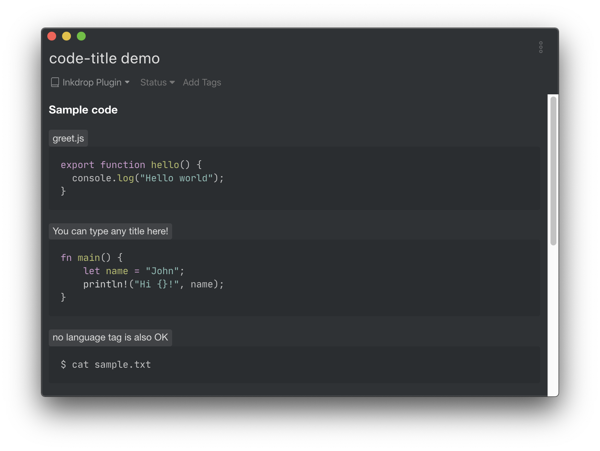
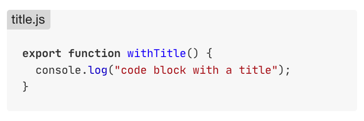
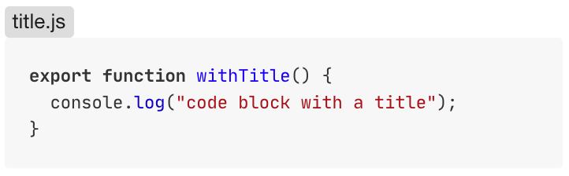

# Code Title

Add a title to a fenced code block

## Usage & Example

Type a colon(`:`) and a title after a `language` tag in a fenced code block as follows.

**Default Light**

**Default Dark**

### Title Position

You can choose the position of titles in the settings.

**Inside of the code block (default)**

**On top of the code block**

