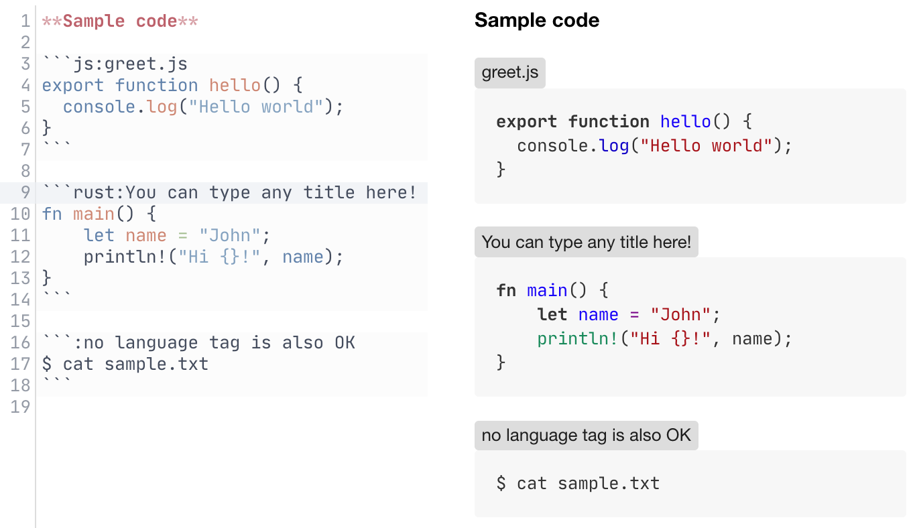

# Code title plugin for Inkdrop


Add a title to a fenced code block.

## Install

```
ipm install code-title
```

## Usage & Example

Type a colon(`:`) and a title after a `language` tag in a fenced code block as follows.



## CHANGELOG

- 1.0.0
  - stable release

- 0.4.0
  - allow spaces in a title