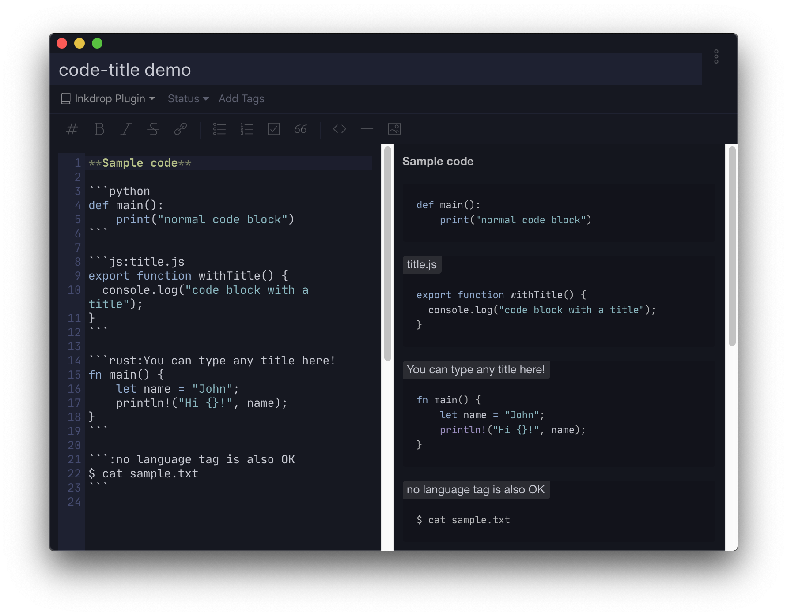

# Code title plugin for Inkdrop


Add a title to a fenced code block.

## Install

```
ipm install code-title
```

## Usage & Example

Type a colon(`:`) and a title after a `language` tag in a fenced code block as follows.

**Default Light**


**Default Dark**


**Nord**


**Iceberg**


## CHANGELOG

- 1.1.0
  - improve color contrast

- 1.0.0
  - stable release

- 0.4.0
  - allow spaces in a title