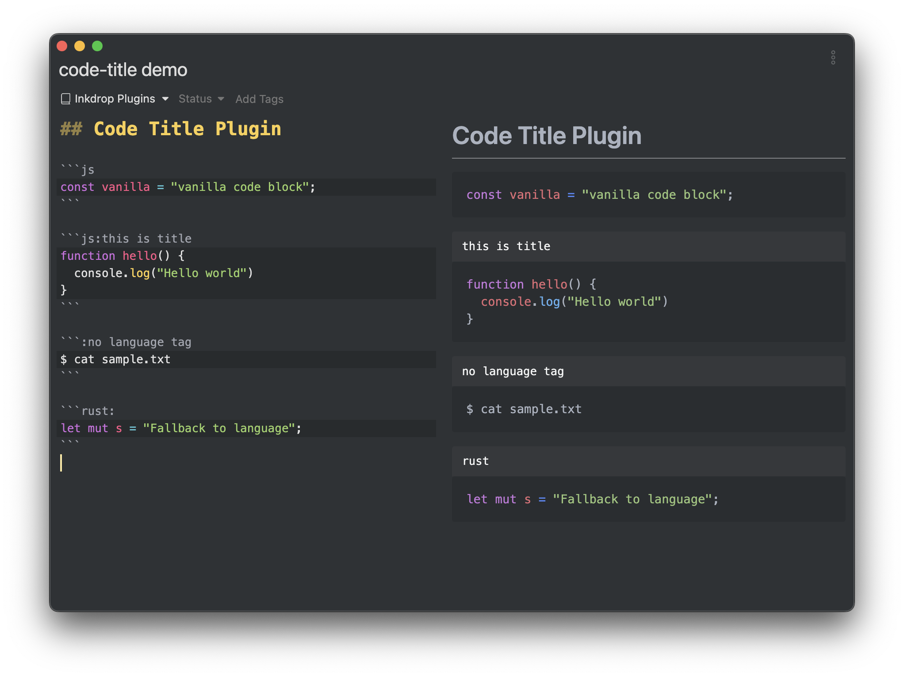

# Code Title


Add a title to a fenced code block



## Install from command line

```
ipm install code-title
```

## Usage & Example

Enter a colon(`:`) and title following the language tag of the fenced code block, as follows

````
```js:this is title
function hello() {
  console.log('Hello world')
}
```
````
