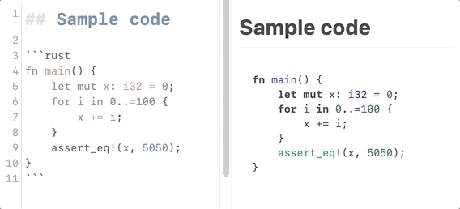

# Code title plugin for Inkdrop

Add a title to fenced code blocks.

## Install

```
ipm install code-title
```

## Usage & Example

Type a colon and a title (such as `:your-title`) after the `language` tag in the
fenced code block.


